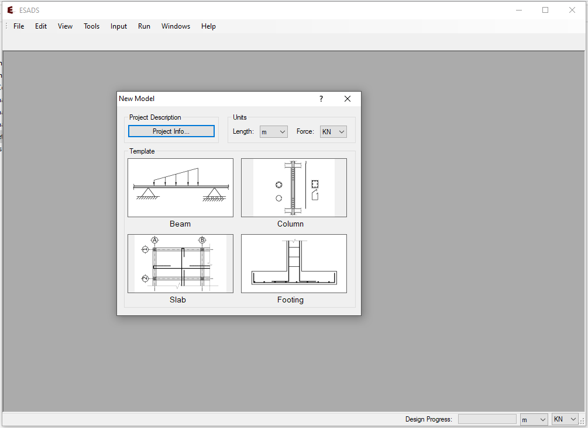

# ESADS
ESADS is a structural analysis and design software developed based on the Ethiopian Building Code of Standards(EBCS-1995). This code is written together with my colleagues during our undergraduate study. The executable version of the program can be downloaded from `Excutables/ESADS_Setup.msi`. Using ESADS, one can analyze and design the following reinforced concrete structures:

- Beams
- Biaxial columns 
- Slabs(not fully functional)
- Foundation footings  

The software has the following key features for each components: 

- Efficeint desing procedure 
- Shows intermediate design outputs 
- Exports the final rebar details to AutoCAD

The implemented numerical details of the program for each structural component are described in the report found in `DOC/ESADS_Final_Report`. 

#### Contributors:
1. Abiy Melaku
2. Tsinuel Geleta
3. Zeineb Mehedi

